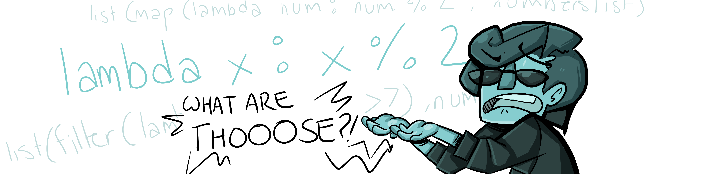
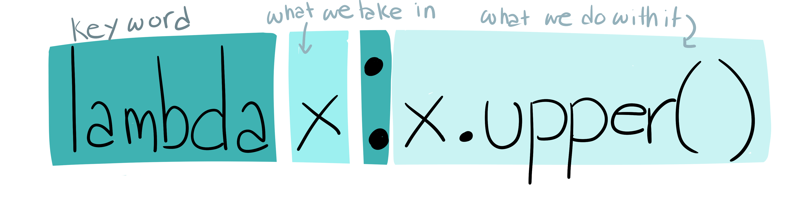

# Lambda (Anonymous) Functions

<a href="./README.md">Functional Programming</a> | <a href="./listcomp.md">List Comprehensions</a>

# The Incredible Hulk is hosting an incredible tea party


Unfortunately, the list of people he wants to invite is not on brand--all the letters are lower case.

```
party_invitees = ["iron man", "cap", "thor", "hawkeye", "black widow", "wasp", "dr strange"]
```

To make the best impression, Hulk wants to make every name on this list UPPERCASE.

```
party_invitees = ["IRON MAN", "CAP", "THOR", "HAWKEYE", "BLACK WIDDOW", "WASP", "DR STRANGE"]
```

**Using a regular function, we can try for something like this:**

```
def fix_my_party(invitees):
    fixed = []

    for x in invitees:
        fixed.append(x.upper())

    return fixed


fixed_party_list = fix_my_party(party_invitees)
print(fixed_party_list)
```

This does indeed work, but the Hulk is a busy man with a short attention span.

He doesn't have the time to write 7 lines!


## Thankfully, we're able to smash all 7 lines into one using a Lamdba Function!

```

print(list(map(lambda x:x.upper(), party_invitees)))

```

It's okay, Hulk is just as confused as we are.

A **lambda function** is a single line function that is intended to be used once and tossed aside. This saves space in your code **AND** makes it easier to read since the reader doesn't have to scroll back to find the function to see what's going on.

**map()** Is a function in Python that takes a list (party_invitees) and applies a function to it (our `lambda x:x.upper()`).

map() returns a map object, so we're using **list()** to print the Hulkified party list as a list.

Hulk appreciates the ingenuity and smashes the regular function in exchange for a lambda one.

### There's another reason why Hulk prefers the one-line lambda function

Lambda functions--like the professor said--are **throwaway functions**. This means after we use the function to print our hulkified list--it disappears. It doesn't take up space in memory. We don't reuse it. We use the function once and are done with it.

If we wanted to reuse the lambda function, we COULD assign it to a variable:

```
hulkify = lambda x:x.upper()

hulkify(another_list)
hulkify(yet_another_list)
```

But that defeats the entire purpose of a lambda function, so you won't see this done often.

Since Hulk isn't planning on throwing another teaparty anytime soon, he doesn't need to keep carrying around the fix_my_party function.

So he smashes it and uses a lambda function instead.

## Okay but they look like gibberish.

Lambda functions are simpler than they look.



**lambda** is the key word that tells Python you're writing a lamdba function (similar to how def tells python you're writing a regular function)

**x** is what we're calling the variable that the lamdba function is taking in (the parameter). Lambda functions can take in multiple parameters (e.g. `lambda x, y:`)

**:** separates the values the lambda function takes in (on the left of the :) from the values it pushes out (on the right of the :)

**x.upper()** is what we're telling the lambda function to do to the x value every time in receives the value. In this case, lambda will run the function `upper()` (which capitalizes every letter in a string) on any value it receives.

### How does lambda know to run on every member of the party list?

It doesn't.

The only thing this lambda knows is **when I receive a value, I need to capitalize it**.

This is why we combine **map()** and lambda.

We give the lambda and the party list to **map()** and it knows to run the lambda function on each member of the party list.

You'll often see lambda used with df.apply(), df.map(), filter()... and pretty much iterative function you can think of.
