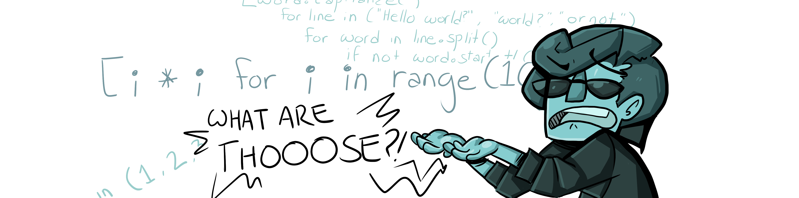
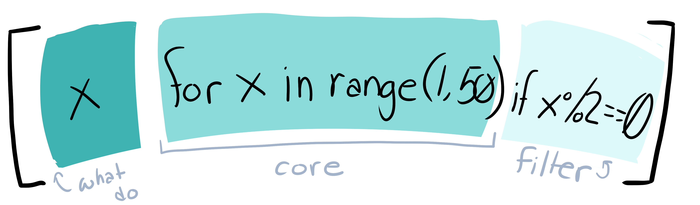

# List Comprehensions (List Comps)

<a href="./README.md">Functional Programming</a> | <a href="./lambda.md">Lambda Functions</a>

## What **ARE** Those?

List comprehensions are the marvelous love child of **for loops** and **list declarations** that you never knew you needed.

Tired of .appending everything to your list? Tired of getting whitespace errors in your for loops? List Comprehensions are for you!

## Starting Simply

We want **to print a list** of every even number between 1 and 50.

We don't care about the list itself. We're not going to use it again. All we want is to print the numbers as a list.

The way we'd normally do this is like:

```
even_numbers = []

for x in range(1, 20):
    if x % 2 == 0:
        even_numbers.append(x)

print(even_numbers)
```

We **can't** just do a print statement in our for loop because that will simply print the individual number as a string. And we want **to print a list**. So we're stuck with all these dang lines and a variable we'll never use again to boot.

### But what if I told you we could do all this in one line


`print([x for x in range(1,50) if x%2==0 ])`

The coolest thing about this is that after we've printed the numbers, there's no leftover variables--concise **and** efficient.

## That's great, but whatever's going on inside of the brackets looks like absolute gibberish to me

Let's split it into parts then.



Typically with a list comprehension, the first place you want to look is at the **for statement**. This is because the action performed is **ahead** of the for statement and the filter (what parts of the list we're performing the action on) is **behind** the for statement.

In our list comprehension, for example:

> **for statement:** for x in range(1,50) (meaning, we will be doing a loop where x is incrementally every number from 1 to 50)
>
> **action performed:** x (meaning, put x into our list)
>
> **filter on:** if x%2==0 (meaning, if we divide x by 2 and the result is 0, we want to perform the action on x )

As you can see, the list comprehension is almost exactly the same as our original for loop. The only difference is that the .append() is assumed--we just write x instead of even_numbers.append(x)

## That's also great, but that Fizz Buzz list comprehension made no sense.

Let's break that into parts given our anatomy lesson, then!

```
['FizzBuzz' if x % 3 == 0 and x % 5 == 0 else
     'Fizz' if x % 3 == 0 else
         'Buzz' if x % 5 == 0 else ''
             for x in range(100) if x % 3 == 0 or x % 5 == 0]
```

**First thing first: Where and what is our for?**

`for x in range(100)`

So we know we're doing a loop where x will incrementally be the numbers 0 - 100

**Next, what is our filter?**

`if x % 3 == 0 or x % 5 == 0`

We have **2** filters here.

We only want to perform the action of this list comprehension if the remainder of x / 3 is 0 **OR** the remainder of x / 5 is 0.

This is because the problem does not want us to write every number. It just wants us to add "Fizz", "Buzz" or "FizzBuzz" depending on whether it's divisible by 3, 5, or 15.

Basically, if a number is not divided by 3 or 5, we will ignore it and move on.

**Next, what is our performing action?**

```
'FizzBuzz' if x % 3 == 0 and x % 5 == 0 else
     'Fizz' if x % 3 == 0 else
         'Buzz' if x % 5 == 0 else ''
```

We've got three this time--and they've nicely organized them for us.

Remember, the result of the action (what we're adding to the list) always comes first.

What we basically have for our action is a bunch of if / else statements. (Like the professor said, there are no elifs in listcomps).

Our first action `if x%3 == 0 and x % 5 ==0` will add `FizzBuzz` to our list if the current value of x is divisible by 3 and 5. Otherwise, it will run the else

Our second action `if % 3 == 0` will add `Fizz` to our list if the current value is divisible only by 3. Otherwise it will run the else.

Our third action `if x % 5 == 0` will add `Buzz` to our list if the current value is divisible by 5. Otherwise, it will run the else.

**Since we have the filter, however, nothing will hit the else. Our filter requires the value of x to be divisible by 3 or 5, so all the numbers the action are performed on will fulfill one of the three if statements.**

## I'm having trouble writing a for loop as a list comprehension

Not every for loop needs to be a list comprehension. If a loop is so complex that you spend sleepless hours trying to puzzle out how to write it as a list comprehension, **it may be a sign that the loop shouldn't actually be written as a list comprehension.**

Remember, the main purpose of these is to save time, save space, and make code efficient.
